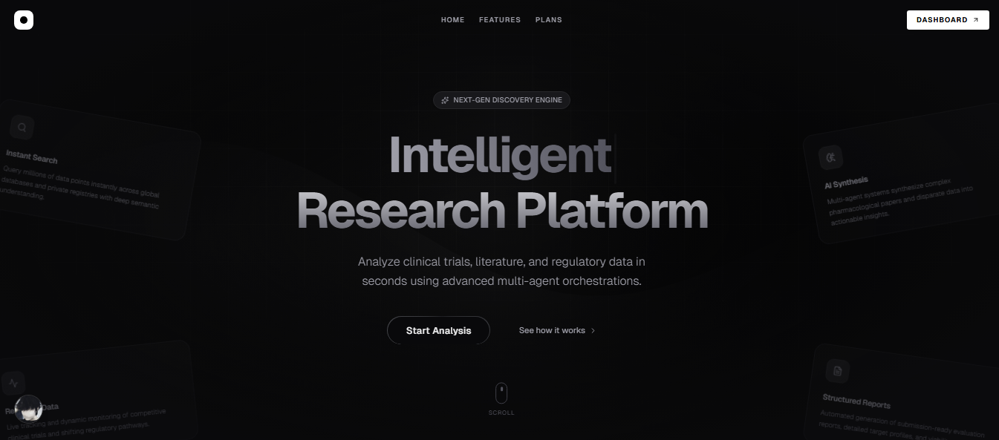
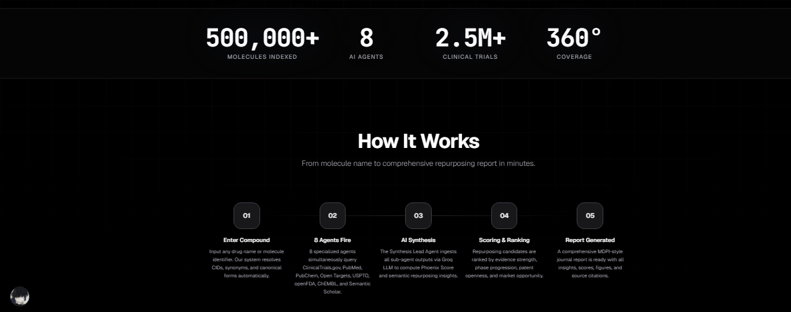
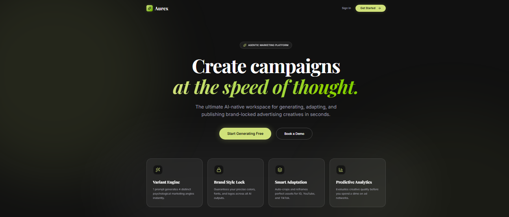
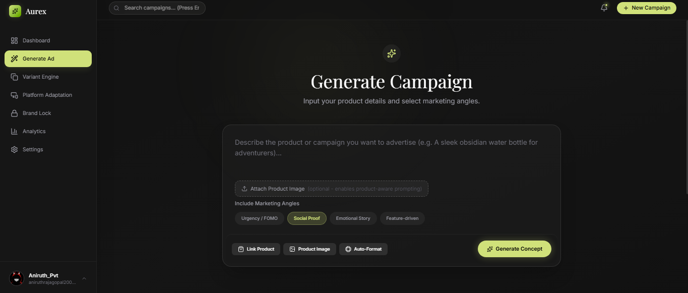
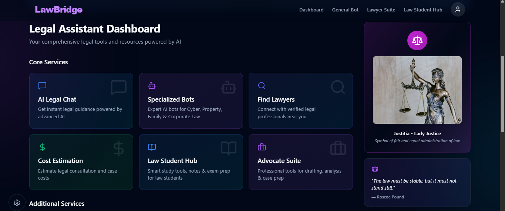
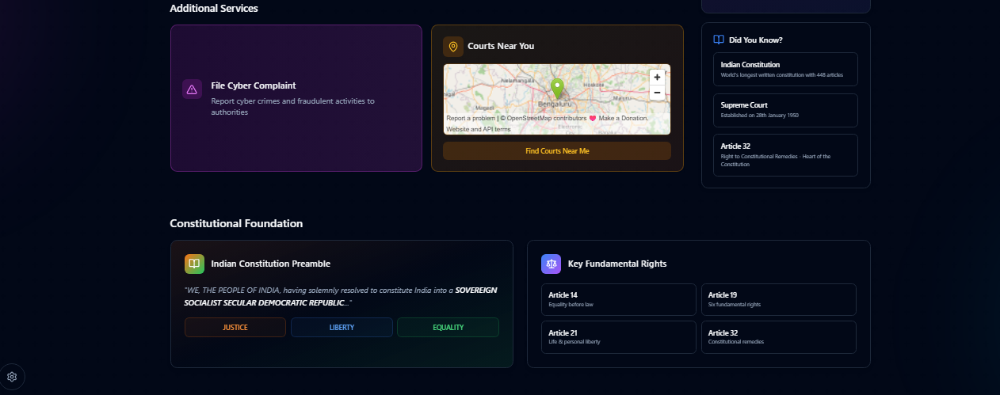

  

 

## 🚀 The Journey

  

 

## 🔥 GitHub & LeetCode Impact

  
  
    
  

 

## ⚙️ Tech Arsenal

  

 

## 🌌 Featured Masterpieces

 

### 🟢 Live Projects

<table border="0" style="border-collapse: collapse;">
  <!-- LUVARA -->
  <tr>
    <td width="50%" valign="top">
      
        
      
    </td>
    <td width="50%" valign="top">
      <h3>🧬 Luvara</h3>
      
An AI-powered drug repurposing platform that leverages an 8-agent orchestration architecture to accelerate molecular research and therapeutic discovery.

      
Built using <b>LangGraph</b> and LLM-powered agents, the system decomposes complex research workflows into specialized tasks such as literature retrieval, analysis, validation, and candidate evaluation. By coordinating agents through structured state management and JSON-based communication, Luvara reduces reasoning complexity, improves reliability, and generates data-driven insights for identifying novel therapeutic opportunities.

       
      
      &nbsp;
      
    </td>
  </tr>
  
  <!-- AUREX -->
  <tr>
    <td width="50%" valign="top">
      
        
      
    </td>
    <td width="50%" valign="top">
      <h3>🎨 Aurex</h3>
      
An AI-powered creative intelligence platform that enables marketers to generate, edit, adapt, and publish advertising creatives through a unified workflow.

      
The platform combines local transformer inference with <b>ComfyUI-powered image generation</b> pipelines and a drag-and-drop canvas editor, allowing users to rapidly create campaign assets while maintaining full creative control. Aurex streamlines the end-to-end creative process, from ideation to deployment, through AI-assisted content generation and visual editing.

       
      
      &nbsp;
      
    </td>
  </tr>
  
  <!-- LAWBRIDGE -->
  <tr>
    <td width="50%" valign="top">
      
        
      
    </td>
    <td width="50%" valign="top">
      <h3>⚖️ LawBridge</h3>
      
An intelligent legal assistant designed to provide accurate and context-aware answers to legal queries, with a specialized focus on Indian cybercrime law.

      
Built using a custom <b>Retrieval-Augmented Generation (RAG)</b> architecture, the platform leverages local embeddings, document indexing, and Gemini-powered reasoning to retrieve relevant legal information and generate reliable responses. By combining domain-specific retrieval with AI-driven analysis, LawBridge helps users navigate complex legal topics with greater clarity and confidence.

       
      
      &nbsp;
      
    </td>
  </tr>
</table>

 

### ⚪ In Development

<table border="0" style="border-collapse: collapse;">
  <tr>
    <td width="50%" valign="top">
      <h3>🎓 AlumInium</h3>
      
A comprehensive alumni management platform designed to strengthen engagement between educational institutions, alumni, and students. The platform enables event organization, job and internship postings, alumni networking, analytics dashboards, and leaderboard-driven participation tracking.

      
Built as a full-stack application, AlumInium streamlines community management while providing institutions with valuable insights into alumni engagement and career opportunities.

       
      
    </td>
    <td width="50%" valign="top">
      <h3>⚙️ ML CPU Scheduler</h3>
      
An adaptive CPU scheduling platform that combines machine learning with traditional operating system scheduling techniques. The system uses a regression model to predict process burst times and dynamically selects the most suitable scheduling algorithm based on workload characteristics.

      
By leveraging predictive analytics, the scheduler aims to improve CPU utilization, reduce waiting time, and optimize overall system performance.

       
      
    </td>
  </tr>
</table>

 

## 📫 Let's Connect!

  
  
  

